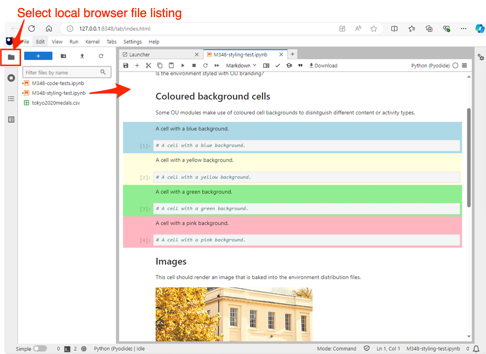

# Installation

*Notes for installing and testing the M348 JupyterLite desktop installation on Windows computers.*

## Installation on Windows

The M348 JupyterLite desktop application is provided as a single executable `.exe` application (`m348-jupyterlite.exe`) that requires no installation and that should be run from the desktop.

Double clicking on the `.exe` file will launch a terminal that runs a start-up script. *It may take up to a minute for the script to run.*

You will be prompted to enter a port number. In the first instance you should accept the default value (`8348`) by hitting `Return`.

The script will start a simple webserver on the desktop and display a link for the application. If the default port is is used, a browser should automatically open onto the application.

If you use a port number other than the default (`8348`), or if you specify the port as 0 to dynamically assign a port, you should use the assigned port number when accessing the environment.

You should now be able to access the JupyterLite environment in your browser. By default the application will be published to `http://localhost:8348` or `http://127.0.0.1:8348` (these both refer to the same location).

### In Case of Startup Issues

If the application does not run on the default port, close the terminal window and try rerunning the application. This time, enter `0` to use a dynamically allocated port number.

When using a port number other than `8348`, the port number should be set in each notebook. The port number appears at the end of the URL. For example, if the URL is `http:127.0.0.1: 8888` or `http://localhost:8888` the port number is `8888`.

If the port number is *not* the default value (`8348`), the `PORTNUMBER` parameter value should be set in each notebook. From the above example, the following should be set: `PORTNUMBER=8888`

## Installation testing

Once the application has been launched and accessed in the browser, you should be presented with a view of a JupyterLab environment.

If you have used the default port value (`8348`) or a port value other than `0`, the application should have automatically opened into browser using the Jupyter Notebook view.

Two notebooks are bundled into the environment: `M348-styling-test.ipynb` and `M348-code-test.ipynb`.

In the local JupyterLab file browser, double click on the `M348-styling-test.ipynb` notebook to open it. It should render a notebook containing coloured cells and an embedded image.

Double click on the `M348-coding-test.ipynb` notebook to open it. From the `Run` menu, select *Run All Cells*.

Hopefully, each cell will run correctly (indicated by a green block in left hand margin of each cell). *Note the test to read a written CSV data file may fail. Everyhting else should pass.*
