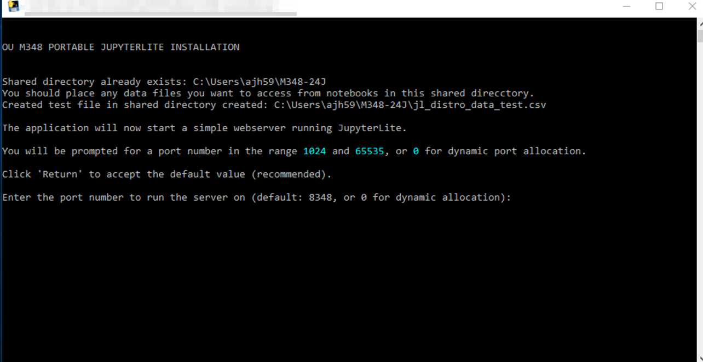
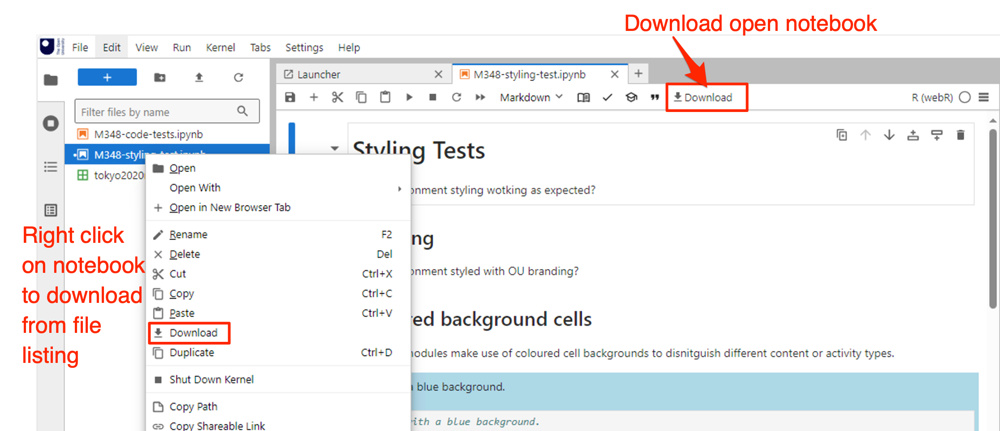

# User Guidance

*Notes for using the M348 JupyterLite desktop installation on Windows computers.*

These guidance notes cover:

- starting the JupyterLite server;
- accessing the JupyterLite environment in a browser
- sharing Jupyter notebook files from the desktop into the application
- sharing data files from the desktop into the application

## Starting the M348 JupyterLite desktop server


The M348 JupyterLite desktop application is provided as a single executable `.exe` application (`m348-jupyterlite.exe`) that requires no installation and that should be run from the desktop.

Double clicking on the `.exe` file will launch a terminal that runs a start-up script. *It may take up to a minute for the script to run.*



You will be prompted to enter a port number. In the first instance you should accept the default value (`8348`) by hitting `Return`.

The script will start a simple webserver on the desktop and display a link for the application. If the default port is is used, a browser should automatically open onto the application.

If you use a port number other than the default (`8348`), or if you specify the port as 0 to dynamically assign a port, you should use the assigned port number when accessing the environment.

*In case of issues, please refer to the __Installation__ section.*

## Accessing the JupyterLite Environment

When the application is running,m you should be able to access the JupyterLite environment in your browser. By default the application will be published to `http://localhost:8348` or `http://127.0.0.1:8348` (these both refer to the same location).

You should be able to access files from your desktop within the JupyterLab environment using the environment's *Local Filesystem Accesss* support as described in the following section.

If you *cannot* access files using this extension, you will need to upload the notebooks you intend to work on at the start of each JupyterLab session, and then save your modified notebooks back to the desktop at the end of each session.

## Local Filesystem Access

The [`jupyterlab-contrib/jupyterlab-filesystem-access`](https://github.com/jupyterlab-contrib/jupyterlab-filesystem-access) extension adds local file system access to the JupyterLab environment (this may not work in all browsers).

This extension allows you to select a directory from your local filesystem (which is to say, the files on your own computer) and access that directory from within Jupyter environment *wherever that environment is actually hosted*, {numref}`jl_local_file_list`

From the "Open new folder" button in the *Local File System" tab, open a directory on your desktop. *You may be prompted for permission.* Sharing the folder allows the browser to read and open the contents of the folder on the desktop in the Jupyter environment.

```{figure} images/jl_shared_fs.png
:name: jl_shared_fs
:width: 5.772370953630796in

Shared desktop filesystem.

Screenshot showing how to mount a directory from the desktop into the JupyterLab UI.

```

*No files are copied: the browser is just given permission to read to them from that directory.*

You can also create files in the Jupyter environment and save them back to the desktop. For example, in the local file system browser, right click and select *New File*. You may be prompted for permission to write to the shared directory (the browser cannot write outside that directory). The file should appear in your desktop folder. If you open and edit the file in the Jupyter environment, then save it, it should be saved to your desktop.

```{figure} images/jl_local_file_list.png
:name: jl_local_file_list
:width: 5.772370953630796in

Local file browser.

Screenshot of a sidebar that lists files mounted into the browser from the local file system. *Note that files are shown for a different module.*

```

Read and write permissions over the shared directory on the local filesystem are granted to the domain serving the environment for the duration of a browser session (i.e. as long as at least one tab is open onto the Jupyter server).

## Uploading Notebooks to the JupyterLite Enviroment

To upload files or zipped file archives, click the up arrow ("Upload Files") icon in the JupyterLab file browser toolbar.


## Downloading Files from the JupyterLite Environent

To download a copy of an open notebook, 

To download a file from the file browser sidebar, right click on the file and then select *Download*.


